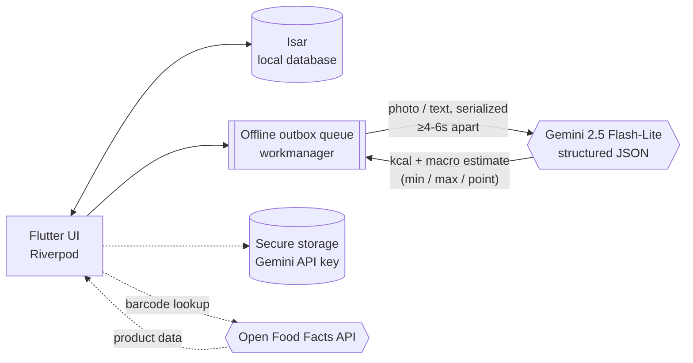
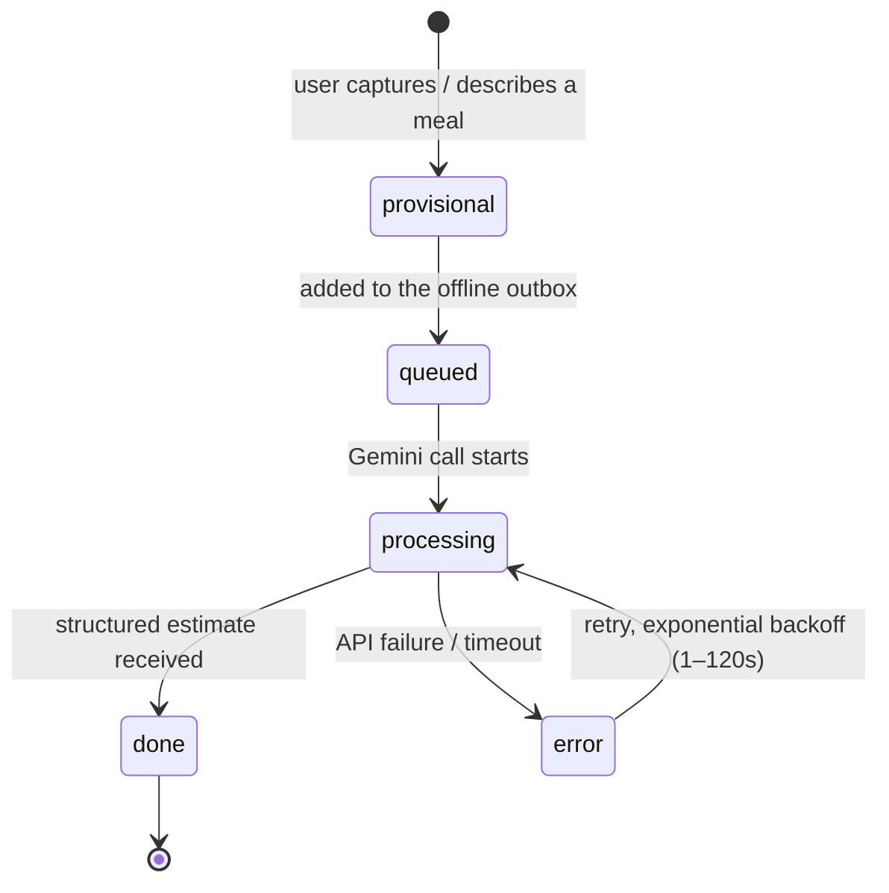
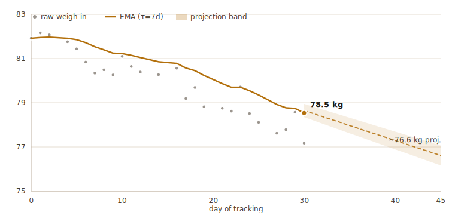

<div align="center">

# GEMA

**Offline-first diet tracker for Android with AI-powered meal estimation.**

Snap a photo, scan a barcode, or just say what you ate — GEMA estimates calories and
macros with Gemini, logs everything locally, and projects your weight trend without
ever requiring a backend.

[](https://github.com/LucasJLBraz/gema/actions/workflows/ci.yml)
[](https://github.com/LucasJLBraz/gema/releases/latest)
[](LICENSE)
[](https://flutter.dev)

</div>

---

## Screenshots

> Screenshots aren't up yet — the current build environment has no Android emulator
> attached to capture them from. Contributions welcome: run the app (see
> [Getting started](#getting-started)) and open a PR adding real captures under
> `docs/img/screenshots/`.

## What is GEMA

GEMA is a personal diet-tracking app built to remove the two biggest sources of
friction in food logging: **manual macro entry** and **dependency on a server you
don't control**.

- **Offline-first.** All data lives in a local [Isar](https://isar.dev) database on
  the device. There is no backend — the app works fully offline except for the AI
  estimation call itself.
- **AI meal estimation.** Take a photo, type a quick description, or use voice input;
  [Gemini 2.5 Flash-Lite](https://ai.google.dev) is called directly from the device
  with structured JSON output to estimate calories and macros as a **range**
  (min/max/point), not a false-precision single number.
- **Bring your own API key.** You provide your own free-tier Gemini API key during
  onboarding. It's stored in the OS secure enclave (`flutter_secure_storage`) and is
  never bundled with the app or sent anywhere but Google's API.
- **Statistically honest projections.** Weight trend uses time-aware EMA smoothing
  (not a naive moving average) and shows weight/goal projections as a confidence
  band, not a single point estimate.
- **No streak-shaming.** XP is cumulative — an off-plan day earns 0 XP but never
  resets progress.

See [`docs/spec_diet_tracker_v2.md`](docs/spec_diet_tracker_v2.md) for the full
product/architecture spec this implementation follows, and
[`HANDOFF.md`](HANDOFF.md) for a detailed engineering status snapshot.

## How it works

Everything the app needs to function day-to-day lives on the device. The only two
network calls are the Gemini estimation request and an optional Open Food Facts
barcode lookup — both are one-shot HTTP calls, not a backend the app depends on:



Every meal — photo, voice/text description, barcode, or manual entry — moves
through the same status pipeline, so the UI always knows whether a number on
screen is confirmed or still in flight:



## Features

| Area | What it does |
|---|---|
| **Meal capture** | Photo capture, free-text/voice description, barcode scan (Open Food Facts), or manual/quick-add entry |
| **Meal pipeline** | Every meal moves through `provisional → queued → processing → done \| error`; nothing is ever silently dropped |
| **Home dashboard** | Calorie ring, macro bars, water intake strip, recent meals list |
| **Analytics** | Daily summaries materialized from raw logs, trend charts |
| **Weight tracking** | EMA-smoothed weigh-in log with OLS trend projection and confidence band |
| **Goals** | Versioned goals with dynamic TDEE — Mifflin/Katch-McArdle bootstrap for the first 21 days, then empirical energy-balance TDEE |
| **Gamification** | Cumulative XP log, levels — no streaks, no punishment for off days |
| **Water tracking** | One-tap water log |
| **Data export** | Export your own data locally, no cloud round-trip |
| **Settings** | Manage your Gemini API key and app preferences |

### Weight trend: EMA smoothing + confidence-band projection

Raw daily weigh-ins are noisy (glycogen, water, sodium). GEMA runs each entry
through a time-aware exponential moving average (`τ = 7 days`, so irregular
gaps between weigh-ins are handled correctly) and fits an OLS trend line over the
smoothed series to project a goal date as a **range**, not a false-precision point.
The chart below is generated from synthetic data run through the exact algorithm in
[`lib/core/algorithms/weight_algorithms.dart`](lib/core/algorithms/weight_algorithms.dart):

<picture>
  <source media="(prefers-color-scheme: dark)" srcset="docs/img/weight_ema_dark.svg">
  
</picture>

### Meal estimation accuracy: benchmarking prompt strategies against ground truth

The Gemini prompt that estimates calories/macros from a meal photo was benchmarked
against 100 real photos (Nutrition5k + SNAPMe, both public CC BY 4.0 datasets) across
several prompt variants — a chain-of-thought ablation, a Brazilian nutrition
reference-table grounding step ([TACO](https://github.com/brolesi/taco)), and a
scale-in-frame detection instruction — before shipping any change to production, using a
paired per-sample t-test rather than aggregate MAPE alone (aggregate metrics can look
improved from a few outliers even when no individual prediction actually got better).

| Arm | Model | N | MAPE kcal | MAE kcal | Bias (mean±sd) | matched_reference_food rate | Latência média |
|---|---|---|---|---|---|---|---|
| baseline | gemini-3.1-flash-lite | 100 | 79.5% | 106.9 kcal | -1.4±159.1 | 0% | 4.1s |
| combined | gemini-3.1-flash-lite | 93 | 76.9% | 108.9 kcal | -0.4±162.0 | 69% | 4.4s |
| grounded | gemini-3.1-flash-lite | 100 | 74.9% | 104.0 kcal | 10.0±146.8 | 68% | 4.2s |
| no_cot | gemini-3.1-flash-lite | 100 | 55.9% | 96.9 kcal | -15.1±145.0 | 0% | 3.6s |
| no_cot_with_scale | gemini-3.1-flash-lite | 100 | 95.7% | 105.8 kcal | -13.1±153.8 | 0% | 5.8s |
| with_scale | gemini-3.1-flash-lite | 100 | 56.8% | 105.3 kcal | -12.4±152.9 | 0% | 3.2s |

Paired comparison of each challenger arm against baseline on the exact same 100 samples
(|t| ≳ 1.98 is roughly the p<0.05 threshold for n≈100 paired samples):

| Challenger arm | N pairs | Challenger wins | Baseline wins | Ties | Mean paired Δ (kcal) | t-stat |
|---|---|---|---|---|---|---|
| combined | 93 | 48 (52%) | 43 (46%) | 2 | 1.9 | 0.26 |
| grounded | 100 | 49 (49%) | 48 (48%) | 3 | 2.9 | 0.40 |
| no_cot | 100 | 47 (47%) | 31 (31%) | 22 | 10.0 | 2.08 |
| no_cot_with_scale | 100 | 40 (40%) | 42 (42%) | 18 | 1.1 | 0.23 |
| with_scale | 100 | 46 (46%) | 38 (38%) | 16 | 1.6 | 0.30 |

**What shipped:** `no_cot_with_scale` — removing the numbered chain-of-thought steps and
adding a scale-in-frame reading instruction, without the TACO reference table — on
`gemini-3.1-flash-lite`. Only the plain chain-of-thought removal (`no_cot`, t=2.08)
cleared the significance threshold on this benchmark; adding the scale instruction on top
brought the paired result back down to statistically indistinguishable from baseline
(t=0.23). We shipped it anyway: none of the 100 benchmark photos contain a visible
kitchen scale, so the scale-reading capability's real value can't be measured against this
ground truth at all — it can only be evaluated once real user photos include one.
Migrating off `gemini-2.5-flash-lite` was justified independent of any of this: it
already returns HTTP 404 for newly-created API keys today, well before its announced
2026-10-16 shutdown.

**Why not TACO grounding:** the reference-table grounding step (`grounded`) showed no
significant per-sample effect on its own (t=0.40), and adding it on top of the
chain-of-thought removal (`combined`) erased that arm's gain entirely (t=0.26 vs.
`no_cot`'s 2.08) — despite raising `matched_reference_food` coverage to ~69%. The leading
(unproven) hypothesis is that the large reference block dilutes the model's attention on
the core estimation task, compounded by the fact that none of the benchmark photos are
Brazilian dishes, so most TACO matches are approximate at best. This runs counter to Yan
et al. (2025)'s finding that RAG-style nutrition-database grounding cut error
substantially on a different multimodal setup — worth revisiting if a Brazilian-dish
benchmark set becomes available.

**On chain-of-thought:** removing the model's step-by-step reasoning instructions was the
single largest, most consistent improvement found (MAPE 79.5% → 55.9%, MAE 106.9 → 96.9
kcal) — the opposite direction from Vedovelli et al. (2026), who found no significant
prompt-engineering effect (including chain-of-thought) across 40 vision-language models on
Nutrition5k. The reason for the reversal here is not established; it may be specific to
this model or this task framing.

**Literature:**
- L. Vedovelli et al., "Model architecture dominates nutritional estimation accuracy in
  vision-language systems," *Scientific Reports*, 2026.
  [doi.org/10.1038/s41598-026-58755-w](https://doi.org/10.1038/s41598-026-58755-w)
- R. Yan et al., "DietAI24 as a framework for comprehensive nutrition estimation using
  multimodal large language models," *Communications Medicine*, 2025.
  [doi.org/10.1038/s43856-025-01159-0](https://doi.org/10.1038/s43856-025-01159-0)
- Benchmark ground truth: [Nutrition5k](https://github.com/google-research-datasets/Nutrition5k)
  (Google Research, CC BY 4.0) and SNAPMe (USDA Ag Data Commons, CC BY 4.0).
- Additional literature underpinning the existing uncertainty-interval calibration is
  cited in [`docs/spec_diet_tracker_v2.md`](docs/spec_diet_tracker_v2.md) §4.

## Tech stack

- **Language / framework:** Dart, Flutter (stable channel)
- **State management:** [Riverpod](https://riverpod.dev) (`flutter_riverpod` + `riverpod_annotation`, code-generated)
- **Local database:** [Isar](https://isar.dev) — reactive, typed, offline-first
- **AI:** Gemini 3.1 Flash-Lite via structured JSON output, called directly from the device
- **Background processing:** `workmanager` (offline outbox queue for meal processing)
- **Secure storage:** `flutter_secure_storage` for the user's Gemini API key
- **Routing:** `go_router`
- **Target:** Android (API 36)

## Project structure

```
lib/
  features/
    meals/          # photo capture, quick-add, barcode, meal status pipeline
    goals/          # TDEE, deficit/surplus targets, versioned goals
    weight/         # weigh-in logging, EMA smoothing, OLS projection
    summary/        # daily_summary materialization, macro bars, calorie ring
    gamification/   # XP log, levels
    water/          # water_log quick entry
    products/       # barcode cache, Open Food Facts lookups
    onboarding/     # setup flow (incl. Gemini API key entry)
    settings/       # app preferences, API key management
  core/
    db/             # Isar instance, collection registrations
    gemini/         # API client, retry/backoff, structured-output schema
    algorithms/      # EMA smoothing, TDEE bootstrap, OLS projection
    router/          # go_router configuration
    theme/           # color tokens, typography
    export/          # local data export
    background/      # workmanager task registration
```

## Getting started

### Prerequisites

- [Flutter SDK](https://docs.flutter.dev/get-started/install) (stable channel, Dart SDK `^3.12.1`)
- Android SDK (API 36) and a device or emulator
- A free [Gemini API key](https://ai.google.dev/) (entered inside the app, not needed to build)

### Setup

```bash
git clone https://github.com/LucasJLBraz/gema.git
cd gema
flutter pub get
```

### Run

```bash
flutter run
```

On first launch, the onboarding flow will ask for your Gemini API key — get a free
one at [aistudio.google.com](https://aistudio.google.com/app/apikey). The key never
leaves your device except in direct calls to Google's Gemini API.

### Build a release APK

```bash
flutter build apk
```

## Testing

```bash
flutter analyze              # static analysis — must pass before committing
flutter test                 # all tests
flutter test test/unit/      # pure-Dart unit tests (no emulator needed) — EMA smoothing, TDEE, OLS, XP, macro scaling
```

Widget tests live in `test/widget/` and integration tests (full meal-logging and
onboarding flows) run against an emulator in `integration_test/`.

## CI/CD

Every push and pull request to `main` runs through [GitHub Actions](.github/workflows/ci.yml):

1. **Static analysis** — `dart format --set-exit-if-changed`, `flutter analyze`, and a check that generated (`*.g.dart`) code is up to date with `build_runner`.
2. **Tests** — full test suite with coverage, uploaded as a build artifact.
3. **Build** — a debug APK is built and published as a downloadable workflow artifact.

On every push to `main`, a separate [release workflow](.github/workflows/release.yml)
builds a release APK and publishes it to the [**Releases** tab](https://github.com/LucasJLBraz/gema/releases/latest)
under a rolling `latest` tag, so there's always a directly installable build of
`main` available without cloning the repo. It's currently debug-signed (see the
`TODO` in `android/app/build.gradle.kts`), so it installs fine for sideloading but
isn't Play Store-ready.

## Isar schema

Collections: `meals`, `meal_components`, `weight_history`, `goals`, `daily_summary`,
`xp_log`, `products`, `water_log`. If you change any `@collection` class, regenerate
the schema and Riverpod providers:

```bash
flutter pub run build_runner build --delete-conflicting-outputs
```

## Design

Color palette and typography tokens are defined in `docs/gema-palette.jsx` and
`docs/gema-storybook.jsx`. UI code should reference semantic token names (e.g.
`primaryAmber`, `surfaceCream`) rather than hard-coded hex values.

## Contributing

This started as a personal project but is open to contributions — issues and pull
requests are welcome. Please run `flutter analyze` and `flutter test` before
submitting a PR; CI will enforce both.

## License

GEMA is licensed under the [GNU General Public License v3.0](LICENSE).
